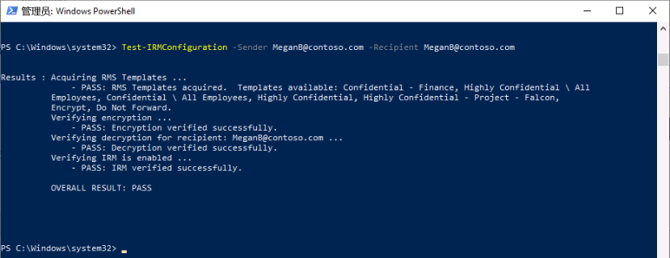
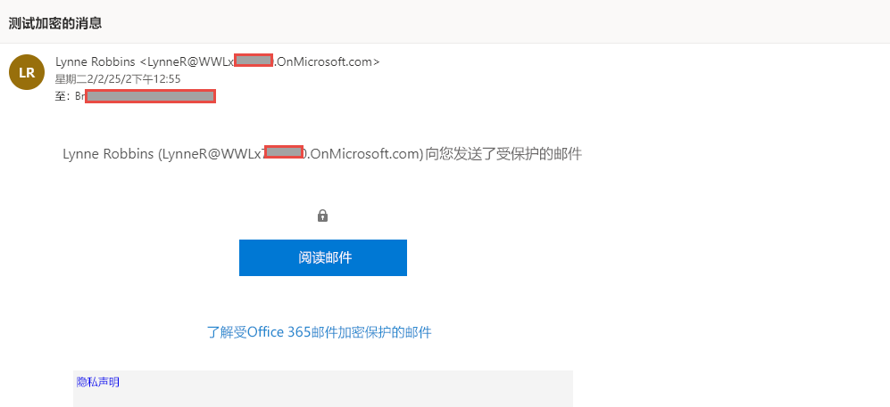

# 实验室 1 - 练习 2 - 管理 Office 365 邮件加密

Joni Sherman 需要对其试点团队配置和测试的第一个设置是 Microsoft 365 内置 Office 365 邮件加密 (OME)。为此，她将修改默认模板并创建一个新的品牌模板，该模板将分配给其中一位试点用户。然后，试点用户将使用其帐户测试 OME 功能。

### 任务 1 - 验证 Azure RMS 功能

在此任务中，你将安装 Exchange Online PowerShell 模块并在 Joni Sherman 的上下文中验证租户的正确 Azure RMS 功能，Joni Sherman 在上一练习中被指定为合规性管理员。

1. 你仍应使用 **lon-cl1\admin** 帐户登录到客户端 1 VM (LON-CL1)。

2. 右键选择 Windows 按钮，然后选择 **“Windows PowerShell (管理员)”**，以打开提升的 PowerShell 窗口。

3. 选择 **“是”** 确认 **“用户帐户控制”** 窗口。

4. 输入以下 cmdlet，安装最新版 Exchange Online PowerShell 模块：

    `Install-Module ExchangeOnlineManagement`

5. 输入表示“是”的 **Y** 并按 **Enter**，以确认“NuGet 提供程序安全”对话框。 此过程可能需要几秒钟时间才能完成。

6.  输入表示“是”的 **Y** 并按 **Enter**，以确认“不受信任的存储库安全”对话框。 此过程可能需要几秒钟时间才能完成。

7. 输入以下 cmdlet 以更改执行策略，然后按 **Enter**

    `Set-ExecutionPolicy -ExecutionPolicy RemoteSigned -Scope CurrentUser`

8. 单击表示“是”的 **Y** 并按 **Enter**，以确认“执行策略更改”。 

9. 关闭 PowerShell 窗口。

10. 右键选择 Windows 按钮，然后选择 **Windows PowerShell**，以打开常规 PowerShell 窗口。

11. 输入以下 cmdlet 以使用 Exchange Online PowerShell 模块并连接到租户：

    `Connect-ExchangeOnline`

12. 显示 **“登录”** 窗口时，以 JoniS@WWLxZZZZZZ.onmicrosoft.com（其中 ZZZZZZ 是实验室托管提供程序提供的唯一租户 ID）登录。  Joni 的密码应由实验室托管提供程序提供。

13. 使用以下 cmdlet 并按 **Enter**，验证是否在租户中激活了 Azure RMS 和 IRM：

    `Get-IRMConfiguration | fl AzureRMSLicensingEnabled`

14. 使用以下 cmdlet 并按 **Enter**，针对另一个试点用户 **Megan Bowen** 测试用于 Office 365 邮件加密的 Azure RMS 模板：

    `Test-IRMConfiguration -Sender MeganB@contoso.com -Recipient MeganB@contoso.com`

    

15. 验证是否所有测试均为“通过”状态，并且未显示任何错误。

16. 使 PowerShell 窗口保持打开状态。

你已成功安装 Exchange Online PowerShell 模块，将其连接到租户，并验证了 Azure RMS 的正确功能。

### 任务 2 - 修改默认 OME 模板

组织中要求限制对外部标识提供者（例如 Google 或 Facebook）的信任。由于默认情况下，这些用于访问受 OME 保护的邮件的社交 ID 处于激活状态，因此需要在组织中停用所有用户的社交 ID。  

1. 你仍应使用 **lon-cl1\admin** 帐户登录到客户端 1 VM (LON-CL1)，并且仍然应该有一个处于打开状态且已连接 Exchange Online 的 PowerShell 窗口。

2. 运行以下 cmdlet 以查看默认的 OME 配置：

    `Get-OMEConfiguration -Identity "OME Configuration" |fl`

3. 查看设置，并确认 SocialIdSignIn 参数设置为 True。

4. 运行以下 cmdlet，以限制使用社交 ID 从受 OME 保护的租户访问邮件：

    `Set-OMEConfiguration -Identity "OME Configuration" -SocialIdSignIn:$false`

5. 单击表示“是”的 **Y** 并按 **Enter**，以确认有关自定义默认模板的警告消息。

6. 再次检查默认配置，并验证 SocialIdSignIn 参数现在设置为 False。

    `Get-OMEConfiguration -Identity "OME Configuration" |fl`

7. 请注意，结果应显示 SocialIDSignIn 设置为 False。使 PowerShell 窗口和客户端保持打开状态。

你已成功停用 Office 365 邮件加密中的外部标识提供者（例如 Google 和 Facebook）。

### 任务 3 - 测试默认 OME 模板

收到租户用户发送的受 Office 365 邮件加密保护的邮件时，必须确认没有为外部收件人显示任何社交 ID 对话框。

1.	使用 **lon-cl2\admin** 帐户登录到客户端 2 VM (LON-CL2)。

2.	从任务栏打开 **Microsoft Edge**，在出现的 **“欢迎使用新的 Microsoft Edge”** 窗口中选择 **“完成设置”** （如果显示）。

3. 选择 **“确认”** 以接受默认浏览器设置，然后选择 **“在不登录的情况下继续”**（如果显示）。

4. 在 **Microsoft Edge** 中，导航到 **https://outlook.office.com** ，并以 LynneR@WWLxZZZZZZ.onmicrosoft.com （其中 ZZZZZZ 是实验室托管提供程序提供的唯一租户 Id）登录到 Outlook 网页版。  Lynne Robin 的密码应由实验室托管提供程序提供。提示：通常它与实验室租户中 MOD 管理员的密码相同。

5. 在 **“保持登录?”** 对话框上，选中 **“不再显示此内容”** 复选框，然后选择 **“否”**。

6. 在 **“保存密码”** 对话框中选择 **“保存”**，将试点用户密码保存在浏览器中。

7. 如果显示 **“从其中翻译页面…”** 窗口，请选择向下箭头，然后选择 **“从不从其中翻译…”**。

8. 从 Outlook 网页版的左上角选择 **“新建邮件”**。

9. 在 **“收件人”** 行中，输入不在租户域中的个人或其他第三方电子邮件地址。在主题行中输入 **“机密邮件”**，并在正文中输入 **“我的超级机密邮件。”**

10. 在顶部窗格中，选择 **“加密”** 以加密邮件。  成功加密邮件后，应会看到一条显示类似于“…此邮件已加密”消息的通知。

11. 选择 **“发送”** 以发送邮件。

12. 登录到个人电子邮件帐户，然后打开来自 Lynne Robbins 的邮件。如果将此电子邮件发送到 Microsoft 帐户（如 @outlook.com），则系统可能会自动处理加密，并自动显示该邮件。如果将电子邮件发送到其他电子邮件服务（如 @google.com），则可能必须执行以下步骤才能处理加密和阅读邮件。

13. 选择 **“阅读邮件”**。

14. 如果未激活社交 ID，则没有用于对 Google 帐户进行身份验证的按钮。

15. 选择 **“使用一次性密码登录”** 以接收限时密码。

16. 转到个人电子邮件门户并打开主题为 **“用于查看邮件的一次性密码”** 的邮件。

17. 复制密码，将其粘贴到 OME 门户中，然后选择 **“继续”**。

18. 查看已加密的邮件。

你已成功使用已停用的社交 ID 测试了修改后的默认 OME 模板。

### 任务 4 - 创建自定义品牌模板

组织财务部门发送的受保护邮件需要特殊的品牌信息，包括自定义的简介和正文文本，以及页脚中的“免责声明”链接。财务邮件也应在 7 天后过期。在此任务中，你将创建新的自定义 OME 配置以及传输规则，以将 OME 配置应用于财务部门发送的所有邮件。

1. 使用 **lon-cl1\admin** 帐户登录到客户端 1 VM (LON-CL1)，应该仍然有一个 PowerShell 窗口已打开且已连接 Exchange Online。

2. 运行以下 cmdlet 以创建新的 OME 配置：

    `New-OMEConfiguration -Identity "Finance Department" -ExternalMailExpiryInDays 7` 

3. 单击表示“是”的 **Y** 并按 **Enter**，以确认有关自定义模板的警告消息。

4. 使用以下 cmdlet 更改说明文本消息：

    `Set-OMEConfiguration -Identity "Finance Department" -IntroductionText " from Contoso Ltd. finance department has sent you a secure message."`

5. 单击表示“是”的 **“Y”** 并按 **Enter**，以确认有关自定义模板的警告消息。

6. 使用以下 cmdlet 更改邮件的正文电子邮件文本：

    `Set-OMEConfiguration -Identity "Finance Department" -EmailText "Encrypted message sent from Contoso Ltd. finance department. Handle the content responsibly."`

7. 单击表示“是”的 **Y** 并按 **Enter**，以确认有关自定义模板的警告消息。

8. 将免责声明 URL 更改为指向 Contoso 的隐私声明站点：

    `Set-OMEConfiguration -Identity "Finance Department" -PrivacyStatementURL "https://contoso.com/privacystatement.html"`

9. 单击表示“是”的 **Y** 并按 **Enter**，以确认有关自定义模板的警告消息。

10. 使用以下 cmdlet 创建邮件流规则，该规则将自定义 OME 模板应用于财务团队发送的所有邮件。  完成此进程可能需要几秒钟时间。

    `New-TransportRule -Name "Encrypt all mails from Finance team" -FromScope InOrganization -FromMemberOf "Finance Team" -ApplyRightsProtectionCustomizationTemplate "Finance Department" -ApplyRightsProtectionTemplate Encrypt`

11. 键入以下 cmdlet 来验证更改。
    `Get-OMEConfiguration -Identity "Finance Department" | Format-List`
    
12. 使 PowerShell 保持打开状态。

你已经成功创建了新的传输规则，当财务部门的成员向外部收件人发送邮件时，该规则将自动应用自定义 OME 模板。

### 任务 5 - 测试自定义品牌模板

要验证新的自定义 OME 配置，需要再次使用财务团队成员 Lynne Robbins 的帐户。

1. 使用 **lon-cl2\admin** 帐户登录到客户端 2 VM (LON-CL2)，你应该已作为 **Lynne Robbins** 登录到 Microsoft 365。 

3. 从左侧导航窗格中选择 **Outlook** 符号。

4. 从 Outlook 网页版的左上角选择 **“新建邮件”**。

5. 在 **“收件人”** 行中，输入不在租户域中的个人或其他第三方电子邮件地址。在主题行中输入 *“财务报告”*，并在正文中输入 *“机密财务信息。”*。

6. 选择 **“发送”** 以发送邮件。

7. 登录到个人电子邮件帐户，然后打开来自 Lynne Robbins 的邮件。

8. 你应会看到 Lynne Robbins 发送的邮件，如下图所示。  选择 **“阅读邮件”**。

    

9. 自定义的 OME 配置激活了社交 ID，因为这两个选项都可用。选择“**使用一次性密码登录**”以接收限时密码。

10. 转到个人电子邮件门户并打开主题为 **“用于查看邮件的一次性密码”** 的邮件。

11. 复制密码，将其粘贴到 OME 门户中，然后选择 **“继续”**。

12. 查看包含自定义品牌信息的加密邮件。

你已经成功测试了新的自定义 OME 模板。 

# 继续进行实验室 1 - 练习 3 
