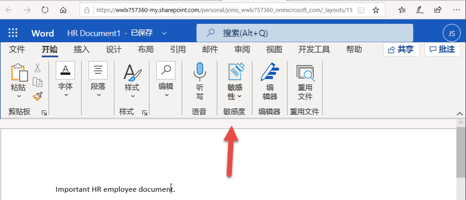

# 实验室 1 - 练习 5 - 管理敏感度标签

在本实验室中，你将扮演 Contoso Ltd 的系统管理员 Joni Sherman。 
你的组织位于德国的雷德尼茨亨巴赫，目前打算实现一个敏感度计划，以确保人力资源部门的所有员工文档都已使用敏感度标签标记为组织信息保护策略的一部分。

### 任务 1 启用对敏感度标签的支持

在本任务中，你将安装 MSOnline 模块和 SharePoint Online PowerShell 模块，并在租户上启用对敏感度标签的支持。

1. 使用 **lon-cl1\admin** 帐户登录到客户端 1 VM (LON-CL1)。

2. 右键选择开始菜单，然后选择 **Windows PowerShell** 并以管理员身份运行，以打开权限提升的 PowerShell 窗口。

3. 输入表示 **“是”** 的 Y 并按 Enter，以确认 **“用户帐户控制”** 窗口。

4. 输入以下 cmdlet，以安装最新版 MS Online PowerShell 模块：

   `Install-Module -Name MSOnline`

5. 输入表示“是”的 **Y** 并按 Enter，以确认“不受信任的存储库安全”对话框。 可能需要几秒钟时间才能完成处理。

6. 输入以下 cmdlet，以安装最新版 SharePoint Online PowerShell 模块：

    `Install-Module -Name Microsoft.Online.SharePoint.PowerShell`

7. 输入表示“是”的 **Y** 并按 Enter，以确认“不受信任的存储库安全”对话框。

8. 输入以下 cmdlet，以连接到 MS Online 服务：

    `Connect-MsolService`

9. 在 **“登录到帐户”** 窗体中，以 **Joni Sherman** 身份 JoniS@WWLxZZZZZZ.onmicrosoft.com（其中 ZZZZZZ 是实验室托管提供程序提供的唯一租户 Id）登录。  Joni 的密码应由实验室托管提供程序提供。

10. 登录后，选择 PowerShell 窗口。

11. 输入以下 cmdlet，以获取域：

    `$domain = get-msoldomain`

12. 输入以下 cmdlet，以创建 SharePoint 管理员 URL：

    `$adminurl = "https://" + $domain.Name.split('.')[0] + "-admin.sharepoint.com"`

13. 输入以下 cmdlet，以登录到 SharePoint Online 管理中心：

    `Connect-SPOService -url $adminurl`

14. 在 **“登录到帐户”** 窗体中，以 **MOD 管理员**身份 admin@WWLxZZZZZZ.onmicrosoft.com（其中 ZZZZZZ 是实验室托管提供程序提供的唯一租户 Id）登录。  管理员的密码应由实验室托管提供程序提供。

15. 登录后，选择 PowerShell 窗口。

16. 输入以下 cmdlet，以启用对敏感度标签的支持：

    `Set-SPOTenant -EnableAIPIntegration $true`

17. 输入表示“是”的 **Y** 并按 Enter，以确认更改。 

18. 关闭 PowerShell 窗口。

你通过 Teams 和 SharePoint 网站成功启用了对敏感度标签的支持。

### 任务 2 - 创建敏感度标签

在本任务中，人力资源部门申请了敏感度标签，以应用于人力资源员工文档。你将为内部文档创建敏感度标签，为人力资源部门创建子标签。

1. 你仍应使用 **lon-cl1\admin** 帐户登录到客户端 1 VM (LON-CL1)。

2. 在 **Microsoft Edge** 中，导航到 **https://compliance.microsoft.com** ， 并以 **Joni Sherman** 身份 JoniS@WWLxZZZZZZ.onmicrosoft.com（其中 ZZZZZZ 是实验室托管提供程序提供的唯一租户 Id）登录到 Microsoft 365 合规性门户。  Joni 的密码应由实验室托管提供程序提供。

3. 在 **Microsoft 365 合规性**门户的左侧导航窗格上，选择“**信息保护**”。  

4. 在 **“信息保护”** 页面的 **“标签”** 选项卡下，选择 **“+ 创建标签”**。

5. 此时会启动 **“新建敏感度标签”** 向导。在 **“为标签命名和创建工具提示”** 页面上的 **“名称”**、**“针对管理员的说明”** 和 **“针对用户的说明”** 中，输入以下信息：

	- **名称**：内部
	- **显示名称**：内部
	- **针对用户的说明**：内部敏感度标签。
	- **针对管理员的说明**：Contoso 的内部敏感度标签。

6. 选择 **“下一步”**。

7. 在 **“定义此标签的范围”** 页面上，选择 **“文件和电子邮件”** 选项。

8. 选择 **“下一步”**。

9. 在 **“选择文件和电子邮件的保护设置”** 页面上，选择 **“下一步”**。

10. 在 **“自动标记文件和电子邮件”** 页面上，选择 **“下一步”**。

11. 在“**定义组和网站的保护设置**”页面上，选择“**下一步**”。

12. 在“**自动标记图式化数据资产(预览)**”页面上，选择“**下一步**”。 

13. 在 **“查看设置并完成”** 页面上，选择 **“创建标签”**。

14. 此时将创建标签，创建后将显示消息：**“已创建标签”**

15. 选择“**完成**”。

16. 在 **“信息保护”** 页面上，突出显示（无需选择）刚创建的内部标签，然后选择竖着的 **“[...]”**。

17. 从下拉菜单中选择 **“+ 添加子标签”**。

18. 此时会启动 **“新建敏感度标签”** 向导。在 **“为标签命名和创建工具提示”** 页面上的 **“名称”**、**“针对管理员的说明”** 和 **“针对用户的说明”** 中，输入以下信息：

   - **名称**：员工数据（人力资源）
   - **显示名称**：员工数据（人力资源）
   - **针对用户的说明**：该人力资源标签是人力资源部门中所有指定文档的默认标签。
   - **针对管理员的说明**：该标签是在与 Jones 女士（人力资源部主管）协商后创建的。如果想更改标签的设置，请与她联系。

19. 选择 **“下一步”**。

20. 在 **“定义此标签的范围”** 页面上，选择 **“文件和电子邮件”** 选项。

21. 选择 **“下一步”**。

22. 在“**选择文件和电子邮件的保护设置**”页面上，选择“**加密文件和电子邮件**”选项。

23. 选择 **“下一步”**。

24. 选择 **“配置加密设置”**。

25. 在加密设置中输入以下信息：

   - **立即分配权限或让用户自行决定?**：立即分配权限
   - **用户对内容的访问权限过期**：永不过期
   - **允许脱机访问**：仅几天
   - **用户在多少天内可以脱机访问内容**: 15

26. 选择 **“分配权限”** 链接

27. 在“分配权限”侧菜单上，选择“**+ 添加任何经身份验证的用户**”。

28. 选择 **“保存”**。

29. 在 **“加密”** 页面上，选择 **“下一步”**。

30. 在 **“自动标记文件和电子邮件”** 页面上，选择 **“下一步”**。

31. 在 **“定义组和网站的保护设置”** 页面上，选择 **“下一步”**。

32. 在“**自动标记图式化数据资产(预览)**”页面上，选择“**下一步**”。 

33. 在 **“查看设置并完成”** 页面上，选择 **“创建标签”**。

34. 此时将创建标签，创建后将显示消息 **“已创建标签”**。

35. 选择“**完成**”。

你已成功为组织的内部策略创建了敏感度标签，为人力资源 (HR) 部创建了敏感度子标签。

### 任务 3 - 发布敏感度标签

现在，你将发布内部敏感度标签和人力资源部敏感度标签，以便人力资源部的用户可以在其人力资源文档中使用发布的敏感度标签。

1. 你仍应使用 **lon-cl1\admin** 帐户登录到客户端 1 VM (LON-CL1)，并且应该以 **Joni Sherman** 身份登录到 Microsoft 365。  以 JoniS@WWLxZZZZZZ.onmicrosoft.com（其中 ZZZZZZ 是实验室托管服务提供程序提供的唯一租户 ID）登录。  Joni 的密码应由实验室托管提供程序提供。

2. 在 Microsoft Edge 中， **“Microsoft 365 合规中心”** 选项卡应该仍处于打开状态。如果是，请选择该选项卡并继续进行下一步。如果该选项卡已关闭，则在新的选项卡中，导航到 **https://compliance.microsoft.com** 。

3. 在 **Microsoft 365 合规性**门户的左侧导航窗格上，选择“**信息保护**”。 

4. 在 **“信息保护”** 页面的 **“标签”** 选项卡上，选择 **“发布标签”**。

5. 此时会启动“发布敏感度标签”向导。

6. 在 **“选择要发布的敏感度标签”** 页面上，选择 **“选择要发布的敏感度标签”** 链接。

7. 右侧将显示名为 **“要发布的敏感度标签”** 的侧栏。

8. 选中 **“内部”** 和 **“内部/员工数据(人力资源)”** 复选框。

9. 选择 **“添加”**。

10. 在 **“选择要发布的敏感度标签”** 页面上，选择 **“下一步”**。

11. 在 **“发布到用户和组”** 页面上，选择 **“下一步”**。

12. 在 **“策略设置”** 页面上，选择 **“下一步”**。

13. 在 **“将默认标签应用于文档”** 页面上，选择 **“下一步”**。

14. 在 **“将默认标签应用于电子邮件”** 页面上，选择 **“下一步”**。

15. 在“**将默认标签应用于 Power BI 内容(预览版)**”页面上，选择“**下一步**”。

16. 在 **“为策略命名”页面上，输入以下信息**：

   - **名称**：内部人力资源员工数据
   - **输入敏感度标签策略的描述**：此人力资源标签将应用于内部人力资源员工数据。

17. 选择 **“下一步”**。

18. 在 **“查看并完成”** 页面上，选择 **“提交”**。

19. 此时将创建策略，创建后将显示消息 **“已新建策略”**。

20. 选择 **“完成”**。

你成功发布了内部和人力资源敏感度标签。请注意，最多可能需要 24 小时才能将更改复制到所有用户和服务。

### 任务 4 - 使用敏感度标签

在本任务中，你将在 Word 和 Outlook 电子邮件中创建敏感度标签。创建的文档将存储在 OneDrive 中，并通过电子邮件发送给人力资源员工。

1. 你仍应使用 **lon-cl1\admin** 帐户登录到客户端 1 VM (LON-CL1)，并且应该以 **Joni Sherman** 身份 JoniS@WWLxZZZZZZ.onmicrosoft.com（其中 ZZZZZZ 是实验室托管服务提供程序提供的唯一租户 ID）登录到 Microsoft 365。  Joni 的密码应由实验室托管提供程序提供。

2. 在 **Microsoft Edge** 中，Microsoft 365 合规中心标签页应该仍处于打开状态。选择地址栏，然后导航到 **https://portal.office.com** 。

3. 如果显示消息 **“使用 Office 365 完成工作”**，请点击右上角的 **X** 将其关闭。

4. 从左侧窗格中选择 Microsoft Word 符号，打开 Word Online。

5. 选择 **“新建空白文档”** 以创建新文档。

6. 如果显示消息 **“你的隐私选项”**，请选择 **“关闭”** 将其关闭。

7. 在 Word 文档中输入以下内容： 

   - 重要的人力资源员工文档。

8. 从顶部窗格选择“**敏感度**”，以打开下拉菜单。选择“**内部**”，以应用标签。
    请注意，你在本练习的任务 1 中运行的脚本为租户激活了 Word 中的敏感度标签。  有时，可能需要一个小时才能在 Microsoft Word Online 中实现该激活。  如果 Word 中未显示敏感度标签菜单，则可能需要稍后返回本实验室，或确保正确完成了本练习的任务 1。
    

9. 选择窗口左上方的 **“文档 - 已保存”**，输入 **“人力资源文档”** 作为文件名，然后按 Enter 键。

10. 关闭选项卡以返回到 Word Online 选项卡。从左侧窗格中选择 Outlook 符号，打开 Web 版 Outlook。

11. 如果显示“欢迎使用”消息，请选择 **X** 将其关闭。

12. 在 Web 版 Outlook 中，从窗口的左上方选择 **“新建邮件”**。

13. 在“收件人”字段中，输入姓名  **Allan**，然后从下拉列表中选择 **Allan Deyoung**。

14. 在“主题”字段中，输入：**人力资源员工数据**

15. 在电子邮件中（页面底部的大内容面板），插入以下消息： 

    亲爱的 Deyoung 先生， 

    请查看随附的重要人力资源员工文档。 

	此致，

	Joni Sherman

16. 从底部菜单中选择回形针符号，然后选择 **“建议附件”** 下方的 **“HR Document.docx”** 来附加文档。

17. 选择 **“发送”**，发送附有文档的电子邮件。

18. 使浏览器窗口保持打开状态。

你成功创建了具有敏感度标签的人力资源 Word 文档，该文档已保存到 OneDrive。然后，你通过也设置了敏感度标签的电子邮件将该文档发送给了人力资源工作人员。

### 任务 5 - 配置自动标记

在本任务中，你将创建敏感度标签，该标签发现文档和电子邮件中包含与欧洲一般数据保护条例 (GPDR) 相关的信息时将自动对其进行标记。

1. 你仍应使用 **lon-cl1\admin** 帐户登录到客户端 1 VM (LON-CL1)。

2. 在 **Microsoft Edge** 中，导航到 **https://compliance.microsoft.com** 并以 **Joni Sherman** 的身份登录到 Microsoft 365 合规性门户。

3. 在 **Microsoft 365 合规**性门户的左侧导航窗格上，选择“**信息保护**”。  

4. 在 **“信息保护”** 页面上，突出显示（无需选择）现有的内部标签，然后选择三个点。

5. 选择 **“+ 添加子标签”** 菜单项。

6. 此时会启动 **“新建敏感度标签”** 向导。在 **“为标签命名和创建工具提示”** 页面上，输入以下信息：

   - **名称**：GDPR 德国
   - **显示名称**：GDPR 德国
   - **针对用户的说明**：本文档或电子邮件包含与欧洲一般数据保护条例 (GPDR) 德国区域相关的数据。
   - **针对管理员的说明**：本标签自动应用于 GDPR 德国文件。

7. 选择 **“下一步”**。

8. 在 **“定义此标签的范围”** 页面上，选择 **“文件和电子邮件”** 选项。

9. 选择“**下一步**”。

10. 在“**选择文件和电子邮件的保护设置**”页面上，选择“**下一步**”。

11. 在“**自动标记文件和电子邮件**”页面上，将“**自动标记文件和电子邮件**”设置为“**已启用**”。

12. 在“**检测符合这些条件的内容**”部分，选择“**+ 添加条件**”，然后选择“**内容包含**”。

13. 在“**内容包含**”部分，选择“**添加文本**”，然后选择“**敏感信息类型**”。

14. 右侧将显示“**敏感信息类型**”面板。

15. 在“**搜索敏感信息类型**”搜索面板中，输入以下信息： 

    `German`

16. 按 Enter 按钮，将显示与德国有关的敏感度信息类型。

17. 按“**全选**”复选框。

18. 选择“**添加**”。

19. 选择“**下一步**”。

20. 在“**定义组和网站的保护设置**”页面上，选择“**下一步**”。

21. 在“**自动标记图式化数据资产(预览)**”页面上，选择“**下一步**”。 

22. 在“**查看设置并完成**”页面上，选择“**创建标签**”。

23. 此时将创建标签，创建后将显示消息：“**已创建标签**”。

24. 选择“**完成**”。

25. 在“**信息保护**”页面上，选择“**发布标签**”。

26. 此时会启动“发布敏感度标签”向导。

27. 在“**选择要发布的敏感度标签**”页面上，选择“**选择要发布的敏感度标签**”链接。

28. 右侧将显示名为“**要发布的敏感度标签**”的侧栏。

29. 选中“**内部**”和“**内部/GDPR 德国**”复选框。

30. 选择“**添加**”。

31. 在“**选择要发布的敏感度标签**”页面上，选择“**下一步**”。

32. 在“**发布到用户和组**”页面上，选择“**下一步**”。

33. 在“**策略设置**”页面上，选择“**下一步**”。

34. 在“**将默认标签应用于文档**”页面上，选择“**下一步**”。

35. 在“**将默认标签应用于电子邮件**”页面上，选择“**下一步**”。

36. 在“**将默认标签应用于 Power BI 内容(预览)**”上，选择“**下一步**”。 

37. 在“**为策略命名**”页面上，输入以下信息：

   - **名称**：GDPR 德国策略
   - **输入敏感度标签策略的描述**：此自动应用敏感度标签策略适用于 GDPR 德国区域。

38. 选择“**下一步**”。

39. 在“**查看并完成**”页面上，选择“**提交**”。

40. 此时将创建策略，创建后将显示消息“**已新建策略**”。

41. 选择“**完成**”。

你已成功为德国区域的 GDPR 文档创建并发布了自动应用敏感度标签。

请注意，应用自动应用的敏感度标签最多可能需要 24 小时，如果要应用的文档超过 25,000 个（即每日限制），则用时更长。

## 你已完成实验室 1。继续进行实验室 2 - 练习 1
