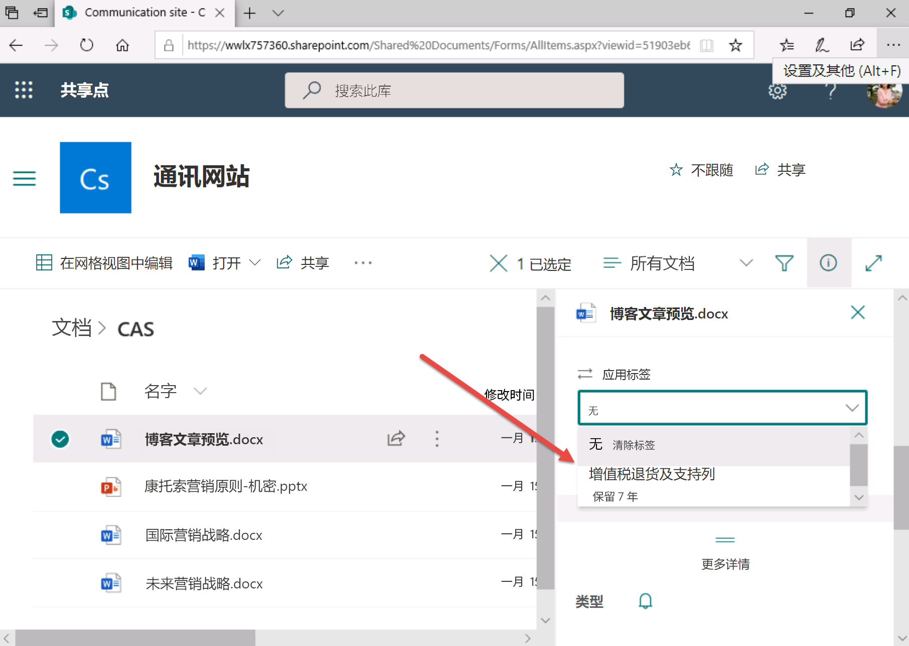

# 实验室 3 - 练习 2 - 实现保留标签

在本练习中，假设你是 Joni Sherman，Contoso Ltd. 的系统管理员。你的组织位于英国萨德伯里，并具有保留财务文档的法律义务。 

财务部门已制定保留计划，打算对增值税 (VAT) 申报表文档（包括支持性文档和信用卡收据）设置保留标签。
 
### 任务 1 - 创建保留标签

在此任务中，你将创建两个保留标签，一个可分配给包含增值税申报表的文档和电子邮件，另一个可应用于信用卡收据。

1. 使用 **“lon-cl1\admin”** 帐户登录到客户端 1 VM (LON-CL1)。

2. 在 **Microsoft Edge** 中，导航到 **https://compliance.microsoft.com** 并以 **Joni Sherman** 的身份登录到 Microsoft 365 合规性门户。

3. 在 **Microsoft 365 合规性**门户的左侧导航窗格中，选择“**策略**”，然后在“**数据**”下选择“**保留**”。

4. 在“信息治理”页面上，选择“**标签**”选项卡。

5. 选择 **“+ 创建标签”** 按钮。

6. 在“**为保留标签命名**”页上的“**名称**”、“**针对用户的说明**”和“**针对管理员的说明**”中，输入以下信息：

	- **名称**：增值税申报表和支持性文档
	- **针对用户的说明**：将此标签分配给增值税文档，以确保其法定保留期为 7 年。
	- **管理员描述**：增值税申报表保留期为 7 年。

7. 选择 **“下一步”** 按钮。

8. 在 **“定义保留期设置”** 页面上，启用 **“将项保留特定时间段”** 设置。

9. 对于 **“定义保留期设置”** 部分，设置以下信息：
	- **保留期**：7 年
	- **保留期开始依据**：项创建时间
	- **保留期结束时**：无操作
	

10. 选择 **“下一步”** 按钮。

11. 在“**查看并完成**”页面上，选择“**创建标签**”按钮。  在“*已创建保留标签*”页面上，选择“**无操作**”，并选择“**完成**”。

12. 返回到“**信息治理**”页面上的“**标签**”选项卡。  我们将在下一个练习发布标签。

13. 选择 **“+ 创建标签”按钮**

14. 在“**为保留标签命名**”页上的“**名称**”、“**针对用户的说明**”和“**针对管理员的说明**”中，输入以下信息：
	- **名称**：信用卡收据
	- **针对用户的说明**：此标签自动应用于保留期为 3 年的信用卡收据
	- **管理员描述**：为保留期为 3 年的信用卡收据自动应用的保留标签。

15. 选择 **“下一步”** 按钮。

16. 对于 **“定义保留期设置”** 部分，设置以下信息：
	- **保留期**：3 年
	- **保留期开始依据**：项创建时间
	- **保留期结束时**：无操作
	

17. 选择 **“下一步”** 按钮。

18. 在“**查看并完成**”页面上，选择“**创建标签**”按钮。在“**已创建保留标签**”页面上，选择“**无操作**”选项，然后选择“**完成**”。

你已成功为保留期为 7 年的增值税申报表创建了保留标签，并为保留期为 3 年的信用卡收据创建了保留标签。

### 任务 2 - 发布保留标签

执行任务 1 之后，你将立即发布增值税申报表保留标签，以便财务用户可以将已发布的标签应用于 Exchange 电子邮件和 Sharepoint 文档中的文档。

1. 你仍应使用 **lon-cl1\admin** 帐户登录到客户端 1 VM (LON-CL1)，并且应该以 **Joni Sherman** 的身份登录到 Microsoft 365。 

2. 在 **Microsoft Edge** 中，Microsoft 365 合规中心门户标签页应该仍处于打开状态。如果是这样，请选择该标签页并继续进行下一步。如果该标签页已关闭，则在新的标签页中，导航到 **https://compliance.microsoft.com** 。

3. 在 **Microsoft 365 合规性**门户的左侧导航窗格中，选择“**策略**”，然后在“**数据**”下选择“**保留**”。

4. 在 **“信息治理”** 页面上，选择 **“标签”** 选项卡。

5. 选择在任务 1 中创建的标签 **“增值税申报表和支持性文档”**。

6. 选择 **“发布标签”** 图标按钮。

7. 在“**选择要发布的标签**”页面上，选择“**下一步**”按钮。

8. 在“**选择要创建的保留策略类型**”页上，选择“**静态**”项。

9. 选择“**下一步**”按钮。

10. 在“**选择位置**”页面上，启用“**让我选择特定位置**”选项。

11. 输入以下信息：
	- “**Exchange 电子邮件**”位置 -“**状态**”：开
	- “**SharePoint 网站**”位置 -“**状态**”：开
	- “**OneDrive 帐户**”位置 -“**状态**”：开
	- “**Office 365 组**”位置 -“**状态**”：关

12. 选择“**下一步**”按钮。

13. 在“**为策略命名**”页上的“**名称**”和“**说明**”中输入以下信息：

	- **名称**：增值税申报表和支持性文档保留标签
	- **说明**：增值税申报表和支持性文档保留标签，保留期为 3 年，用于 Exchange 电子邮件和 SharePoint 网站位置。

14. 选择“**下一步**”按钮。

15. 在“**查看设置**”页面上，选择“**提交**”按钮。创建策略后，选择“**完成**”。

你已成功发布增值税申报表和支持性文档的保留标签。

### 任务 3 - 发布自动应用保留标签

执行任务 1 之后，现在将自动应用信用卡收据保留标签，以便保留信息。

1. 你仍应使用 **lon-cl1\admin** 帐户登录到客户端 1 VM (LON-CL1)，并且应该以 **Joni Sherman** 的身份登录到 Microsoft 365。 

2. 在 **Microsoft Edge** 中，Microsoft 365 合规性门户标签页应该仍处于打开状态。如果是这样，请选择该标签页并继续进行下一步。如果该标签页已关闭，则在新的标签页中，导航到 **https://compliance.microsoft.com** 。

3. 在 **Microsoft 365 合规性**门户的左侧导航窗格中，选择“**策略**”，然后在“**数据**”下选择“**保留**”。

4. 在 **“信息治理”** 页面上，选择 **“标签”** 选项卡。

5. 选择在任务 1 中创建的标签 **“信用卡收据”**。

6. 选择 **“自动应用标签”** 图标按钮。  将显示“将标签自动应用于内容”向导。

7. 在 **“为自动标记策略命名”** 页上的 **“名称”** 和 **“说明”** 中输入以下信息：
	- **名称**：自动应用信用卡收据
	- **说明**：信用卡收据自动应用的保留标签，所有位置的保留期均为 3 年

8. 选择 **“下一步”** 按钮。

9. 在 **“选择要应用此标签的内容类型”** 页面上，为“选择要应用此标签的内容类型”选择以下选项：

	- **将标签应用于包含敏感信息的内容**

10. 选择 **“下一步”** 按钮。

11. 在 **“包含敏感信息的内容”** 页面上，选择以下类别：**“财务”**。 

12. 然后，财务模板将作为结果显示在模板类别面板的右侧。 

13. 在“财务模板”面板上，向下滚动结果并选择 **“英国财务数据”**。

14. 选择 **“下一步”** 按钮。

15. 在 **“定义包含敏感信息的内容”** 页面上，选择 **“下一步”** 按钮。

16. 在“**选择要创建的保留策略类型**”页上，选择“**静态**”项。 

17. 在“**选择应用策略的位置**”页面上，启用以下选项：“**Exchange 电子邮件”、“OneDrive 帐户”、“SharePoint 网站”和“Microsoft 365 组**”，然后选择“**下一步**”。

18. 在“**选择要自动应用的标签**”页面上，选择“**下一步**”。

19. 在“**选择要自动应用的标签**”页面上，选择“**提交**”按钮。创建策略后，选择“**完成**”。

你已经成功发布了自动应用的保留标签。在接下来的 7 天内，所有包含信用卡详细信息的文档将自动标上已发布的标签“信用卡收据”，这些项的保留期将为 3 年。

### 任务 4 - 在 Outlook 电子邮件中使用保留标签

在此任务中，你将为 Outlook 电子邮件分配保留标签

1. 使用 **“lon-cl1\admin”** 帐户登录到客户端 1 VM (LON-CL1)。

2. 在页面底部的任务栏上，选择“开始”按钮，向下滚动，然后选择 **“Outlook”**。如有必要，请以 **Megan Bowen** 身份 MeganB@WWLxZZZZZZ.onmicrosoft.com（其中 ZZZZZZ 是实验室托管服务提供程序提供的唯一租户 ID）登录。  Megan 的密码应由实验室托管提供程序提供。

3. 在 Outlook 应用程序中，选择 **“收件箱”**

4. 在中心窗格中使用鼠标右键选择第一个电子邮件项，然后在菜单中选择 **“分配策略”**。

5. 此时将显示保留策略列表。

6. 如果可用，选择“**增值税申报表和支持性文档**”，否则从现有策略中选择“**1 个月后删除**”（仅适用于本练习中的设置）。**备注** 保留标签在发布后可能需要七天时间才能显示在 Exchange Online 中，且邮箱必须包含 10 MB 数据。

7. 让 **Outlook** 保持打开状态。

你已成功将保留标签应用于 Outlook 电子邮件。

### 任务 5 - 在 Outlook 文件夹中使用保留标签

在此任务中，你将为 Outlook 文件夹分配保留标签。

1. 你仍应使用 **“lon-cl1\admin”** 帐户登录到客户端 1 VM (LON-CL1)，并且 **Outlook** 应处于打开状态。如果还没有打开 **Outlook**，请以 **Megan Bowen** 的身份登录。

2.  右键单击左侧面板中的 **“收件箱”**

3.  选择 **“新建文件夹…”**，并输入：增值税申报表

4.  选择“**确定**”按钮

4.  右键单击左侧面板中新创建的 **VAT Returns** 文件夹

5.  从菜单中选择 **“属性”**

6.  选择 **“策略”** 选项卡

7.  如果可用，请将“**文件夹策略**”下拉列表设置为“**增值税申报表和支持性文档**”，否则从现有策略中选择“**5 年后删除**”（仅适用于本练习中的设置）。**备注** 保留标签在发布后可能需要七天时间才能显示在 Exchange Online 中，且邮箱必须包含 10 MB 数据

8. 选择 **“确定”** 按钮

9. 通过选择右上角的关闭 **“X”** 按钮来关闭 Outlook 应用程序

你已成功将保留标签应用于 Outlook 文件夹，该文件夹中所有电子邮件的默认保留标签将根据在此子任务中的选择进行分配。

你已成功将保留标签应用于 Outlook 文件夹。

### 任务 6 - 在 SharePoint 中使用保留标签

在此任务中，你将对 SharePoint 文档库中的文档应用保留标签。

1. 你仍应使用 **“lon-cl1\admin”** 帐户登录到客户端 1 VM (LON-CL1)。

2. 在 **“Microsoft Edge”** 中，导航到 **https://www.office.com** 并以 **Joni Sherman** 的身份登录到 Microsoft 365。

3. 在 Microsoft O365 登陆页面上，选择左上角的“应用启动器”图标（该图标带有九个点），然后从子菜单中选择 **“SharePoint”**。

4. 在 SharePoint 登陆页面上，向下滚动并选择“**通信网站**”SharePoint 网站。**备注**：在搜索栏中键入“**通信网站**”并进行搜索。

5. 在顶部导航栏中，选择 **“文档”** 链接。

6. 选择 **CAS** 文件夹

7. 在 CAS 文件夹中，突出显示（但不要选择）**Blog Post preview.docx** 文档

8. 对于突出显示的文档，选择垂直的 **[...]** 按钮。  将鼠标悬停在 **“更多”** 选项上。

9. 从展开的菜单中，选择 **“合规性详细信息”** 按钮。

10. 侧菜单随即显示。  对于 **“标签状态”**，应会显示 **“无”** 一词，请选择它。  此时会打开一个浏览器标签页，可在其中应用标签。

11. 如果该选项可用，请将“**应用标签**”设置为“**增值税申报表和支持性文档**”，并选择“**保存**”。由于发布保留标签可能需要一些时间，因此可能无法立即使用该选项，如果该选项不可用，请继续执行下一个任务。请稍后再返回此任务，然后重试。

    

你已成功将保留标签应用于 SharePoint 中的文档。

### 任务 7 - 在 OneDrive 中使用保留标签

在此任务中，你将向 OneDrive 中的文档应用保留标签。

1. 你仍应使用 **lon-cl1\admin** 帐户登录到客户端 1 VM (LON-CL1)，并且应该以 **Joni Sherman** 的身份登录到 Microsoft 365。 

2. 在 **“Microsoft Edge”** 中，导航到 **https://www.office.com** 并以 **Joni Sherman** 的身份登录到 Microsoft 365。

3. 在 Microsoft O365 登陆页面上，选择左上角的“应用启动器”图标（该图标带有九个点），然后从子菜单中选择 **“OneDrive”**。

4.  在 OneDrive 应用程序中，突出显示（但不要选择）**Contractor Legal Info.docx** 文档

5. 对于突出显示的文档，选择三个垂直的 **[...]** 按钮

6. 从菜单中，选择 **“详细信息”** 按钮。  

7. 侧菜单将出现在右侧。  你应会看到 **“应用标签”** 选项，单击该选项。

8. 如果该选项可用，请将“**应用保留标签**”设置为“**增值税申报表和支持性文档**”。由于发布保留标签可能需要一些时间，因此可能无法立即使用该选项，如果该选项不可用，请继续执行下一个任务。请稍后再返回此任务，然后重试。

你已成功将保留标签应用于 OneDrive 中的文档。

# 继续进行实验室 3 - 练习 3
